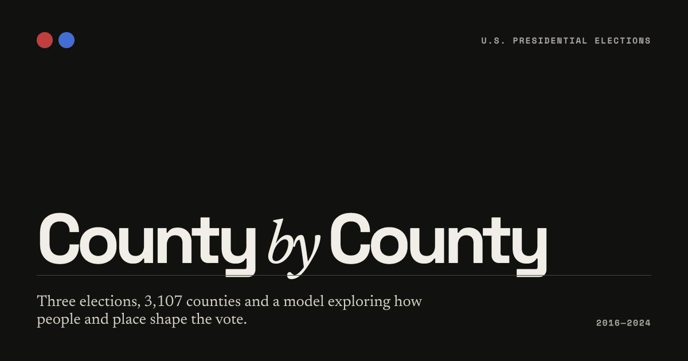

<p align="center">
  <a href="https://county-by-county.vercel.app">
    
  </a>
</p>

<p align="center">
  <strong>Three presidential elections. 3,107 counties. One national story told locally.</strong>
</p>

<p align="center">
  <a href="https://county-by-county.vercel.app"><strong>Explore the live project →</strong></a>
  &nbsp;&nbsp;·&nbsp;&nbsp;
  <a href="https://www.youtube.com/watch?v=XGsaWqbOf9w">Watch the T3chFest talk</a>
  &nbsp;&nbsp;·&nbsp;&nbsp;
  <a href="https://t3chfest.es/2025/programa/puede-la-ia-predecir-al-presidente/">Talk details</a>
</p>

---

## America, county by county

**County by County** is an interactive data story about the 2016, 2020 and 2024 U.S. presidential elections. It connects county-level election returns with demographic and socioeconomic data to explore one question:

> How do people, place and history shape the vote?

The project moves from local results to national outcomes: it analyses electoral change at county level, compares several machine-learning models and uses Monte Carlo simulation to make uncertainty visible all the way to the Electoral College.

| **3,107** | **03** | **30+** | **538** |
|:---:|:---:|:---:|:---:|
| counties analysed | election cycles | census variables | electoral votes |

## Explore the project

| Section | What you can do |
|---|---|
| [**Our results**](https://county-by-county.vercel.app/results) | Read the final simulation, electoral map, distributions and state-level uncertainty. |
| [**Election atlas**](https://county-by-county.vercel.app/explore) | Compare presidential results at state and county level across three elections. |
| [**Variables**](https://county-by-county.vercel.app/variables) | Explore how income, education, race, age and other county characteristics relate to the vote. |
| [**Methodology**](https://county-by-county.vercel.app/methodology) | Follow the complete path from raw public data to Electoral College outcomes. |
| [**Data**](https://county-by-county.vercel.app/data) | Inspect the sources, feature dictionary and downloadable project datasets. |
| [**Project**](https://county-by-county.vercel.app/project) | Meet the authors and find the talk, code and related resources. |

## From counties to the White House

```text
Election returns + Census ACS
              │
              ▼
      County-level dataset
              │
              ▼
 Ridge · Random Forest · XGBoost
              │
              ▼
    County vote-share change
              │
              ▼
 State totals + Monte Carlo uncertainty
              │
              ▼
        Electoral College
```

The repository includes:

- A multi-page **Next.js data experience** with maps, interactive charts, election comparisons and model explainability.
- Harmonised county datasets for the **2016, 2020 and 2024** election cycles.
- **Census ACS** variables covering population, education, race, income, employment and other local characteristics.
- **Ridge, Random Forest and XGBoost** models trained on county-level electoral change.
- A **FastAPI** service that aggregates predictions into state results and Electoral College simulations.
- Reproducible **Jupyter notebooks** for collection, processing, analysis, modelling and simulation.

## Repository map

```text
US-Elections/
├── api/              FastAPI prediction service
├── data/             Raw and prepared tabular datasets
├── geo/              Census county boundaries
├── imgs/             Analysis exports and figures
├── models/           Trained model artifacts
├── web/              Next.js website
└── *.ipynb           Reproducible analysis pipeline
```

## Run it locally

### Website

```bash
cd web
cp .env.example .env.local
npm install
npm run dev
```

Open [localhost:3000](http://localhost:3000). The deployed website includes static project results, so the main experience works without a running Python service.

### Prediction API · optional

Run the Python engine when developing or recomputing model predictions:

```bash
python3 -m venv .venv
source .venv/bin/activate
pip install -r requirements.txt
uvicorn api.main:app --reload --port 8000
```

The API exposes:

```text
GET /health
GET /predict?n_sim=200&model=ridge
GET /explain?model=xgboost
```

The website proxies prediction requests through its own `/api/predict` route using `PREDICTION_API_URL`.

## Read the results carefully

- County deltas are stored and displayed in percentage points.
- Popular-vote figures in the atlas show the two-party vote share.
- Alaska is not included in county modelling because its election-reporting geography is not directly comparable. Following the explicit prior in `simulation.ipynb`, its three electoral votes are assigned to the Republican total and labelled as an assumption.
- Global feature importance describes how the fitted model uses its inputs; it is not a causal interpretation of voting behaviour.
- The model is exploratory. It does not ingest live polling, candidates, campaign events or causal effects.
- ACS values are survey estimates, and neighbouring counties are not statistically independent.

## The talk behind the project

**¿Puede la IA predecir al presidente?** — Machine Learning y patrones de voto en EEUU<br />
Presented by Lucía Cordero Sánchez and Jorge Garcelán Gómez at **T3chFest 2025**.

[Watch the full talk on YouTube](https://www.youtube.com/watch?v=XGsaWqbOf9w) · [Visit the official T3chFest page](https://t3chfest.es/2025/programa/puede-la-ia-predecir-al-presidente/)

## Authors

**[Lucía Cordero Sánchez](https://github.com/lucia-corsan)** · Data scientist & AI engineer<br />
**[Jorge Garcelán Gómez](https://github.com/jorgegarcelan)** · Data scientist & AI researcher

---

<p align="center">
  
</p>

<p align="center"><sub>Open source under the MIT License.</sub></p>
